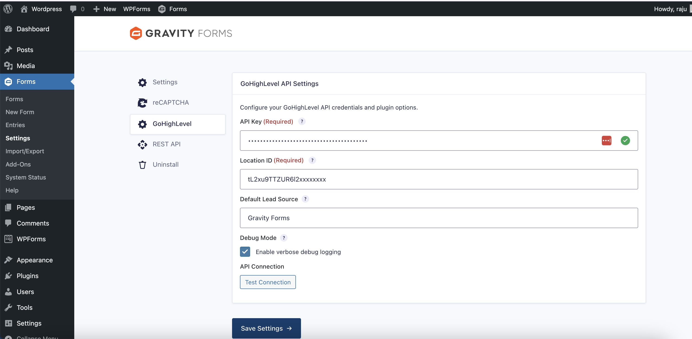
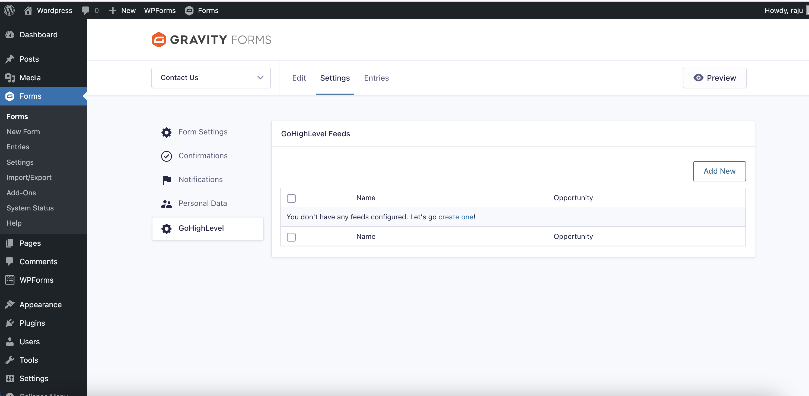
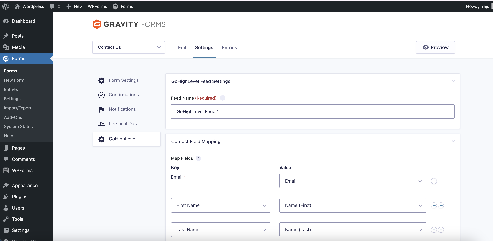
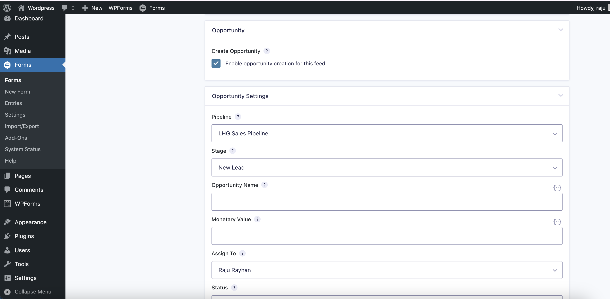
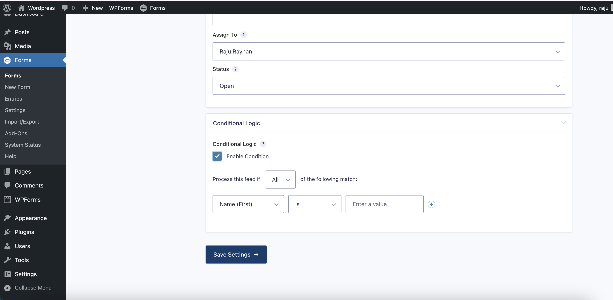

# GoHighLevel Gravity Form Add-On

A Gravity Forms add-on that syncs form submissions to **GoHighLevel** (LeadConnector API). It creates or updates Contacts and optionally creates Opportunities in your GHL pipelines.

**Author:** [RakaAITech](https://rakaaitech.com)

---

## Features

- **Contact sync** — Create or update GoHighLevel contacts from Gravity Forms submissions (search by email to avoid duplicates).
- **Opportunity creation** — Optionally create opportunities in a selected pipeline/stage with configurable name, value, status, and assignee.
- **Field mapping** — Map form fields to contact properties: First Name, Last Name, Email, Phone, custom fields, and tags.
- **Conditional logic** — Use Gravity Forms’ built-in conditional logic to control when feeds run.
- **Duplicate protection** — Entries are marked as synced so they are not processed twice.
- **Background processing** — Sync runs asynchronously so form submission is not blocked.
- **Structured logging** — API requests, responses, and errors are logged (gated by Debug Mode).
- **Test connection** — Validate your API key and Location ID from the settings page.

---

## Requirements

| Requirement | Version |
|-------------|---------|
| **WordPress** | 6.0+ |
| **PHP** | 8.1+ |
| **Gravity Forms** | 2.5+ |
| **GoHighLevel** | LeadConnector API (API key + Location ID) |

---

## Installation

1. **Install Gravity Forms** (if not already installed).
2. **Install the plugin**
   - Download or clone this repo into `wp-content/plugins/gohighlevel-gravity-add-on/` (or `lh-ghl-gravity-addon/` if using the legacy folder name).
   - Or upload the plugin folder to `wp-content/plugins/` and extract.
3. **Activate** the plugin in **Plugins** in the WordPress admin.
4. **Configure** under **Forms → Settings → GoHighLevel** (see [Configuration Guide](#configuration-guide)).

---

## Configuration Guide

This section walks you through setting up the GoHighLevel Gravity Add-On from scratch.

### Screenshots overview

| Screenshot | Description |
|------------|-------------|
| [GoHighLevel settings](#step-2-configure-the-add-on-in-wordpress) | API key, Location ID, and Test Connection |
| [GoHighLevel feeds list](#step-3-create-a-feed-for-a-form) | Form settings → GoHighLevel feeds |
| [Contact field mapping](#step-3-create-a-feed-for-a-form) | Mapping form fields to GHL contact properties |
| [Opportunity mapping](#step-3-create-a-feed-for-a-form) | Pipeline, stage, value, assignee |
| [Conditional logic](#step-3-create-a-feed-for-a-form) | When to run the feed |

---

### Step 1: Get your GoHighLevel API credentials

1. Log in to your **GoHighLevel** account (app.gohighlevel.com or your white-label URL).
2. Go to **Settings** (gear icon) → **API Keys** (or **Business Settings → API** depending on your GHL version).
3. Create a new **API Key** or copy an existing one.
   - Ensure the key has permissions for **Contacts** (create/read/update) and **Opportunities** if you plan to create opportunities.
   - Copy and store the key securely; it may be shown only once.
4. Find your **Location ID**:
   - In GoHighLevel, go to **Settings → Business Info** (or **Location Settings**).
   - Your **Location ID** is usually in the URL when viewing the location (e.g. `https://app.gohighlevel.com/v2/location/LOCATION_ID_HERE`) or listed in business/location details.
   - It often looks like `loc_xxxxxxxxxxxx` or a similar string.

### Step 2: Configure the add-on in WordPress

1. In WordPress admin, go to **Forms → Settings**.
2. Open the **GoHighLevel** tab (or **GoHighLevel API Settings** section).
3. Enter your **API Key** and **Location ID**.
4. (Optional) Set **Default Lead Source** (e.g. `Gravity Forms` or `Website Form`).
5. (Optional) Enable **Debug Mode** for troubleshooting; leave off in production.
6. Click **Save Settings**.
7. Click **Test Connection** to confirm the API key and Location ID are valid. You should see: *Connection successful! API key and Location ID are valid.*



### Step 3: Create a feed for a form

1. Go to **Forms → [Your Form]** (or create a new form).
2. In the form editor, open **Settings → GoHighLevel** (in the left sidebar).
3. Click **Add New** to create a feed.



4. **Feed name** — Give the feed a descriptive name (e.g. “Main contact sync”).
5. **Contact Field Mapping** — Map at least **Email** (required), plus any other fields (First Name, Last Name, Phone, etc.). Use the dropdowns to match form fields or enter custom/merge tag values.



6. **Custom Fields** (optional) — If you use custom fields in GoHighLevel, map them here. Choices are loaded from your location.
7. **Tags** (optional) — Add comma-separated tags (merge tags supported).
8. **Opportunity** (optional) — Enable "Create Opportunity" and choose Pipeline, Stage, Opportunity Name, Monetary Value, Assign To, and Status as needed.



9. **Conditional Logic** (optional) — Enable and set conditions so the feed runs only when certain field values are met.



10. Click **Save Settings**.

### Step 4: Test a submission

1. Submit a test entry on the form (use a real email that you can check in GoHighLevel).
2. In GoHighLevel, open **Contacts** and search for that email. The contact should appear or be updated.
3. If opportunity creation is enabled, check the pipeline you selected for the new opportunity.
4. If something fails, enable **Debug Mode** under **Forms → Settings → GoHighLevel** and check the add-on log (see [Viewing logs](#viewing-logs-troubleshooting)).

### Summary of settings reference

| Where | Setting | Description |
|-------|---------|-------------|
| **Forms → Settings → GoHighLevel** | API Key | Your GoHighLevel (LeadConnector) API key. |
| | Location ID | Your GHL location/sub-account ID. |
| | Default Lead Source | Default value for new contacts’ lead source. |
| | Debug Mode | When on, detailed logs are written for every API call. |
| **Per-feed (Form Settings → GoHighLevel)** | Feed Name | Label for this feed. |
| | Contact Field Mapping | Map form fields to GHL contact fields (Email required). |
| | Custom Fields | Map to GHL contact custom fields. |
| | Tags | Comma-separated tags for the contact. |
| | Create Opportunity | Enable and set pipeline, stage, name, value, assignee, status. |
| | Conditional Logic | When to run this feed. |

---

## Usage

1. Create or edit a form in Gravity Forms.
2. Go to **Form Settings → GoHighLevel** and **Add New** feed.
3. Name the feed and map at least **Email** (required) and any other contact fields.
4. Optionally enable **Create Opportunity** and set pipeline, stage, name, and value.
5. Optionally add conditional logic so the feed runs only when conditions are met.
6. Save the feed.

On submission, the add-on will (in the background):

1. Evaluate conditional logic.
2. Skip if the entry was already synced.
3. Validate mapped fields (email required).
4. Search for an existing contact by email in GHL.
5. Create or update the contact.
6. Create an opportunity if enabled.
7. Mark the entry as synced and log the result.

### Dynamic dropdowns on the frontend

You can show **dropdown or radio options from GHL** on the form so visitors select from live GHL data; the selected value is then sent to GHL when you map that form field in the feed.

1. Add a **Dropdown** or **Radio** field to your form.
2. In the field’s **Appearance** tab, set **CSS Class Name** to one of:
   - `ghl-choices-pipelines` — options from your GHL pipelines
   - `ghl-choices-users` — options from your GHL location users
   - `ghl-choices-custom-KEY` — options from a GHL custom field (e.g. `ghl-choices-custom-project_type` for custom field key `project_type`)
3. Save the form. On the frontend, the field’s choices will be loaded from GHL (cached for 5 minutes).
4. In the **GoHighLevel** feed, map this form field to the matching GHL contact or custom field so the selected value is saved to GHL.

---

## Project structure

```
gohighlevel-gravity-add-on/     # or lh-ghl-gravity-addon (local)
├── gohighlevel-gravity-add-on.php   # Main plugin file & bootstrap
├── includes/
│   ├── class-lh-ghl-addon.php      # GF add-on (feeds, settings UI)
│   ├── class-lh-ghl-api.php        # GoHighLevel API client
│   ├── class-lh-ghl-background.php  # Async processing
│   ├── class-lh-ghl-logger.php     # Logging wrapper
│   └── helpers.php                 # Helper functions
├── screenshots/                  # Screenshots for README & wp.org assets
├── tests/                       # PHPUnit tests
├── composer.json
└── README.md
```

---

## Viewing logs (troubleshooting)

When nothing is syncing to GoHighLevel, use logs to see why (validation errors, API errors, or background job not running).

### 1. Enable Gravity Forms logging

1. In WordPress admin go to **Forms → Settings**.
2. Open the **Logging** section.
3. Turn **Enable Logging** **On** and save.

### 2. Enable this add-on’s debug logging (recommended)

1. Go to **Forms → Settings → GoHighLevel**.
2. Check **Enable verbose debug logging** and save.

This adds detailed lines (processing start/end, API requests/responses, contact search/create/update). Without it, only **errors** (e.g. validation failure, API failure) are logged.

### 3. Open the add-on log

1. Go to **Forms → Settings**.
2. Open the **Logging** tab.
3. Find **GoHighLevel Gravity Add-On** in the list.
4. Turn logging **On** for it if needed, then use **view log** to open the log file.

All messages are prefixed with `[GoHighLevel]`. Look for:

- **Processing Start / End** — Confirms the feed ran and whether it succeeded, skipped, or failed.
- **Validation Error** — Email missing/invalid or other validation; sync is aborted.
- **Processing Failure** — API step failed (e.g. search contact, create contact); the log includes the API error code and message.
- **API Request / API Response** — Only when debug logging is on; shows what was sent to GHL and what came back.

### 4. If the Logging tab is empty or “GoHighLevel” is missing

- Ensure **Enable Logging** is On under Forms → Settings (main Logging section).
- Save settings and reload the Logging tab; the add-on should appear in the list.
- After submitting a form (or when an error occurs), the add-on log file is created and **view log** becomes available.

### 5. Background sync (wp-cron)

Sync runs in the background. If your host doesn’t run wp-cron reliably, submissions may never be sent. Check the log for “Processing Start” after a form submit; if it never appears, the background job may not be firing. As a workaround, use a real cron job that calls: `wp cron event run gf_lh_ghl_background_process` (or use a plugin like “WP Crontrol” to run cron manually).

---

## Development & testing

- **PHP 8.1+** required.
- Dependencies (including PHPUnit) are managed by Composer.

```bash
cd gohighlevel-gravity-add-on   # or lh-ghl-gravity-addon if using that folder name
composer install
./vendor/bin/phpunit
```

---

## Security & performance

- API key is stored with `autoload=false` and is never sent to the frontend.
- Mapped field values are sanitized; email format is validated.
- Admin output is escaped.
- Form submission is not blocked; sync runs via `wp_schedule_single_event()` (or equivalent background mechanism).
- The add-on is designed to use at most a small number of HTTP calls per submission (contact search, create/update contact, create opportunity when enabled).

---

## License

GPL-2.0+. See [license URI](https://www.gnu.org/licenses/gpl-2.0.html).

---

## Changelog

### 1.0.0

- Initial release.
- Contact create/update, optional opportunity creation, field mapping, conditional logic, duplicate protection, background processing, and logging.
